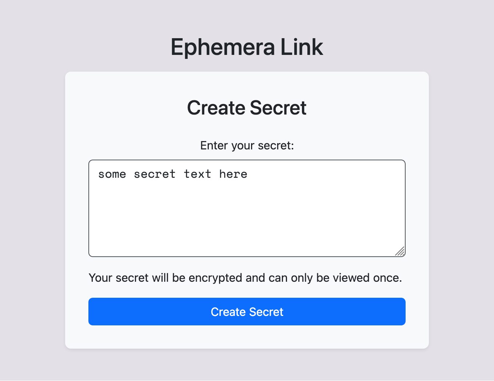
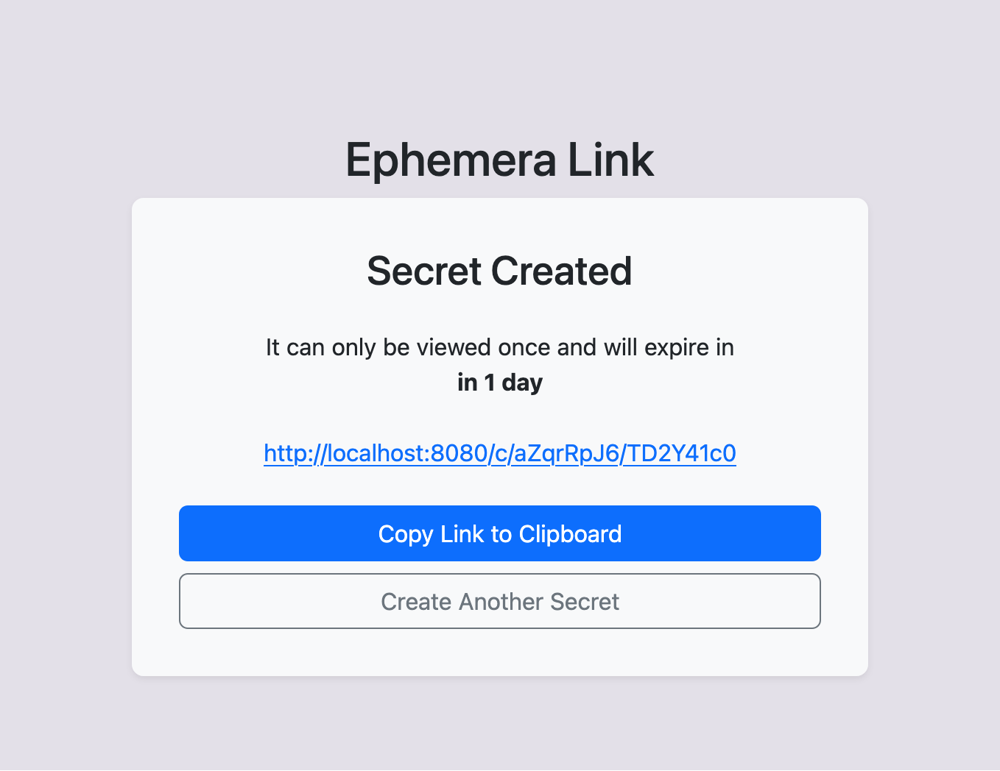
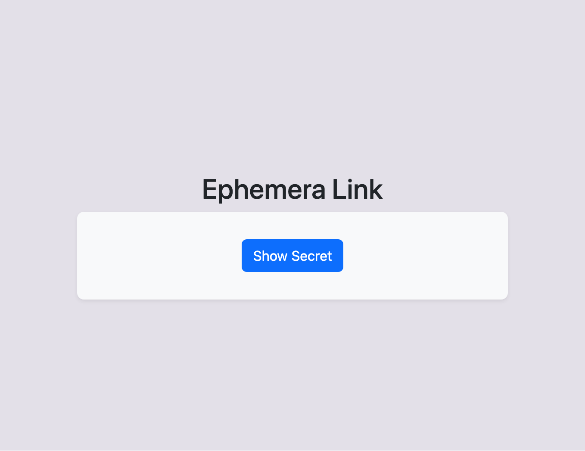
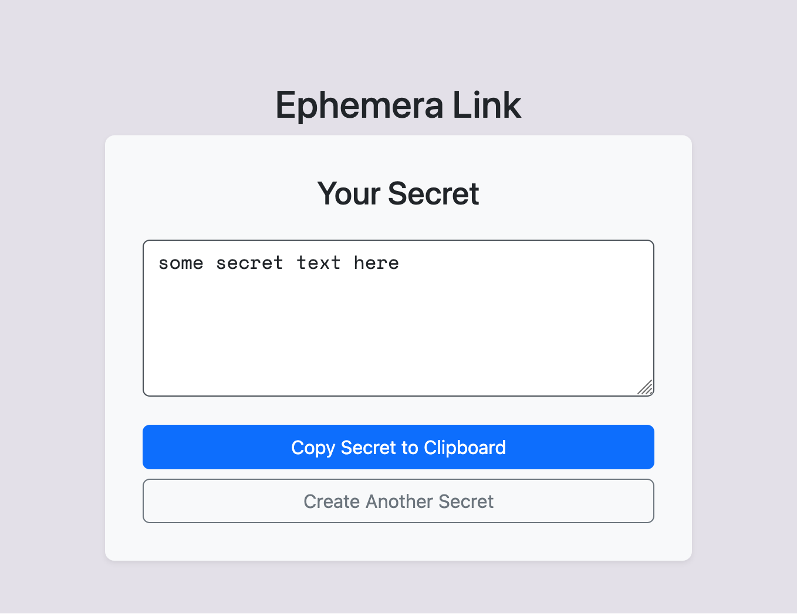

# ephemera-link

Simple web app for creating encrypted secrets that can be viewed only once via unique random link.

## Features

- All in one Go binary.
- The data can be stored in memory or in a database file.
- The data is encrypted with the AES-256 algorithm.
- Unique link to a secret with a configurable length.

## Configuration

Can be passed via `.env` file in the same folder where app binary is located.

Or via environment variables.

| Variable | Default value | Description |
|----------|---------------|-------------|
| URI | `http://localhost:8080/` | Root URI with schema for links |
| LISTEN_PORT | `8080` | On which TCP port app should listen |
| KEY_PART | | Secret string for encryption (`pwgen -cnsy 24 1`) |
| PERSISTENT_STORAGE | `false` | Bool: store data in memory or in database file |
| STORAGE_PATH | `data` | Path to database folder |
| ID_LENGTH | `8` | First random part of the link |
| KEY_LENGTH | `8` | Second random part of the link |
| RUN_CLEARING_INTERVAL | `1800` | How often clear expired secrets in seconds |
| SECRETS_EXPIRE | `86400` | Secret expire time after created in seconds |

Sample `.env` file:

```sh
DOMAIN=https://secret.example.com/
LISTEN_PORT=8080
KEY_PART='xgfhY>Wek7g*-WGc<yAy|YFR'
PERSISTENT_STORAGE=true
STORAGE_PATH=/app/data
ID_LENGTH=8
KEY_LENGTH=8
RUN_CLEARING_INTERVAL=1800
SECRETS_EXPIRE=86400
```

## Build and run

```bash
docker build -t ephemera-link .
docker run --name ephemera-link -d -p 8080:8080 --env-file .env -v data:/app/data ephemera-link
```

## Screenshots

Index page:



Saved page:



View page:



Retrieve page:


